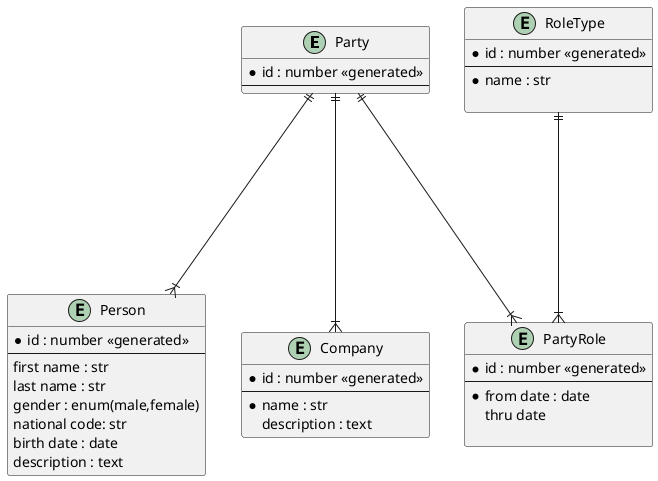

## Pricing Overview

طرف حساب

### Party Relations
| Type  | Symbol  |
|---|---|
|   Zero or One |  `|o--` |
|   Exactly One |  `||--` |
|   Zero or Many |  `}o--` |
|   One or Many |  `}|--` |

### Schema
	
