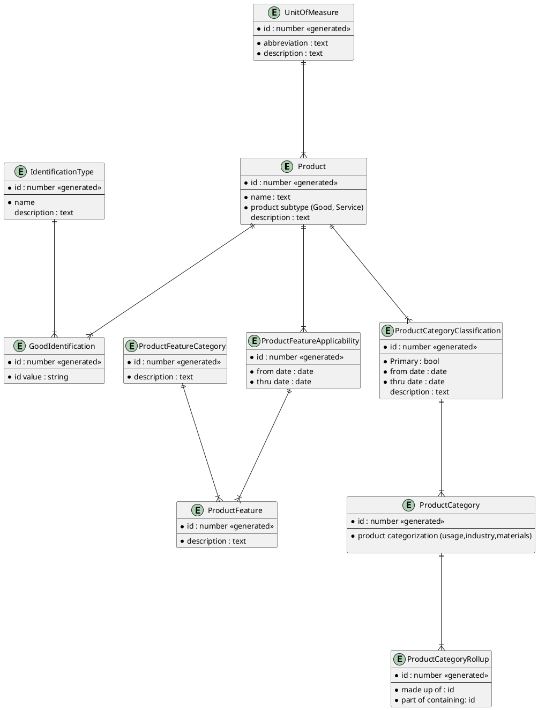
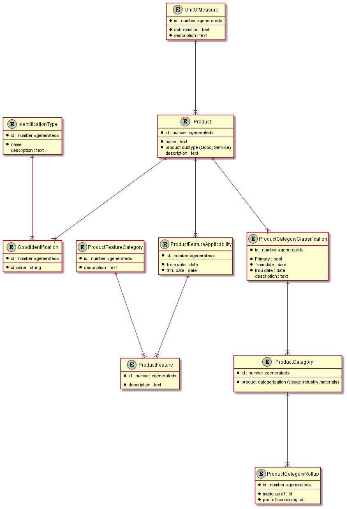

## Product Overview

محصول شامل اجزای زیر است:

- ویژگی
- دسته بندی
- شناسه‌های هویتی
- واحد سنجش

### Product Relations
| Type  | Symbol  |
|---|---|
|   Zero or One |  `|o--` |
|   Exactly One |  `||--` |
|   Zero or Many |  `}o--` |
|   One or Many |  `}|--` |

### Schema
	

## Output

